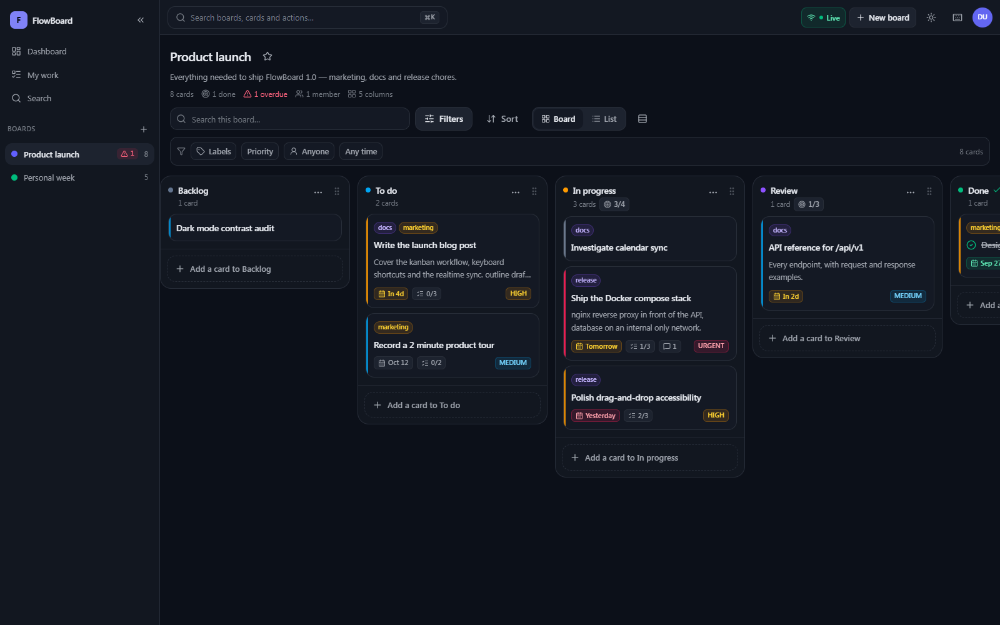
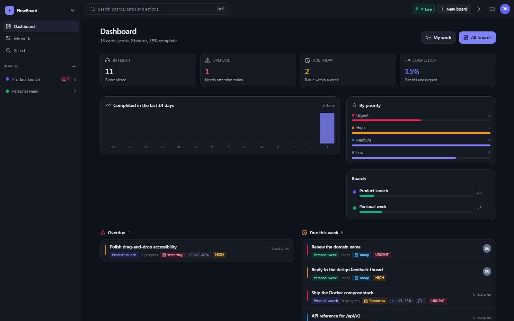
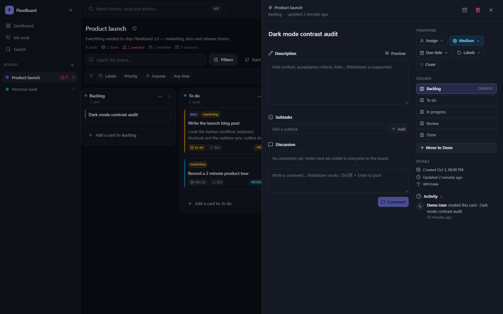
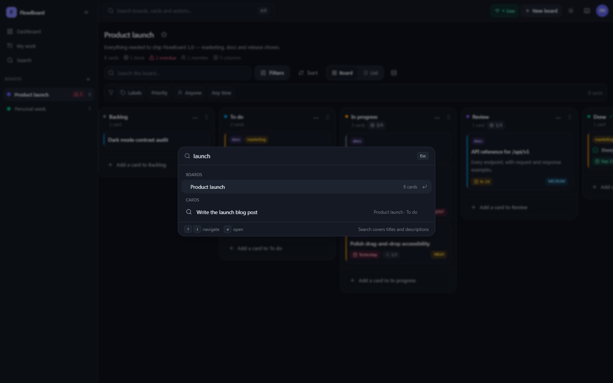
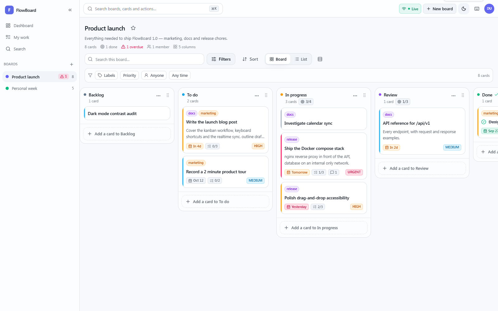

# FlowBoard

**A kanban board for people who actually ship.**

Go · SQLite · React 19 · TypeScript · nginx · Docker



---

## What it is

FlowBoard is a full-stack kanban/TODO application: boards, columns, cards, labels,
subtasks, comments, due dates, work-in-progress limits and a realtime stream so
nobody works from a stale board.

It is built as a real product rather than a demo — argon2id password hashing,
rotating refresh tokens, board-level roles, an audit trail, transactional
drag-and-drop persistence, and a container setup where the API has no route to
the internet.

| Dashboard | Card detail |
| --- | --- |
|  |  |
| *What is on fire, what is moving.* | *Markdown, subtasks, discussion, per-card activity.* |

| Command palette | Light theme |
| --- | --- |
|  |  |
| *`⌘K` searches boards, cards and actions.* | *Every surface has a light palette.* |

More: [My work](docs/screenshots/my-work.png) ·
[Boards gallery](docs/screenshots/boards-gallery.png) ·
[Sign-in](docs/screenshots/sign-in.png)

---

## How this was built

FlowBoard was built by **DSH (DeepSeek Harness)**, an agentic coding harness, in
**a single request** to the **DeepSeek-V41-Flash** model. The entire prompt was:

```
i want build nice TODO list with lots of features like popular canban panes. make it with great UX/UI
stack: backend go, frontend: react + ts
ci/cd: docker isolate network + nginx as reverse proxy
```

There was no starter template, no repository scaffolding and no follow-up
specification. Everything in this repository came out of that one prompt: the
schema and store layer, the REST + SSE API, the drag-and-drop board and its
keyboard parity, the container topology with an internal-only network, and the
CI pipeline. From that single request: roughly **7,200 lines of Go**, **8,900
lines of TypeScript/React**, **45 endpoints**, **12 SQLite tables**, and two
container images (30.8 MB API, 74.8 MB web).

### What building it consumed

Usage for the whole session that produced this repository — the initial request
above plus the follow-up questions about the code:

| Token usage | Tokens |
| --- | ---: |
| Cached input | 61,840,000 |
| Uncached input | 87,403 |
| Output | 351,631 |
| **Total** | **62,279,034** |
| Cache hit rate (of input) | 99.9% |

Cached input, uncached input and output account for the total exactly.

| Context window | Tokens |
| --- | ---: |
| Messages | ~359K |
| Tool definitions | ~5.6K |
| System prompt | ~1.5K |
| **Used** | **~411K of 1M (41%)** |

The per-category context figures are approximate and cover the listed categories
only, so they do not sum to the reported total.

The result was then verified rather than assumed — `gofmt`, `go vet` and
`go test -race` on the backend, a strict TypeScript build, a headless browser
driving both the dev server and the built image, and the running Docker stack
with its network isolation asserted. That process is what caught the realtime
publishing bug described under [Testing](#testing).

---

## Feature tour

**Boards and columns**
- Multiple boards per account, each with its own columns, labels and members.
- Board templates (classic kanban, sprint, personal planner, simple list) applied
  at creation.
- Per-column **work-in-progress limits** that are enforced server-side: the board
  refuses the drop instead of quietly allowing overload.
- Columns can be marked *counts as done*, which stamps `completedAt` when a card
  arrives and clears it when the card leaves.

**Cards**
- Inline capture: press `n`, type, `Enter`. The composer stays open so a whole
  backlog can be brain-dumped without touching the mouse.
- Priority (low → urgent), due date with overdue/today/tomorrow chips, cover
  colour, assignee, labels, markdown description with a preview toggle, subtasks
  with progress, comments and a per-card activity trail.
- Archive (reversible) or delete permanently, both behind an explicit action.

**Working on a board**
- Drag and drop with pointer **or keyboard** (focus a card, `Space`, arrows,
  `Space`), with a lifted drag preview and optimistic persistence.
- Filters: free text, labels, priority, assignee (including "me"/"unassigned")
  and due-date windows, with honest counts of what is hidden.
- Board view and dense list view; compact-card mode; show-archived toggle.
- Search across every board, plus a "My work" view grouped by urgency.
- Realtime: changes from other people appear immediately, with a connection
  indicator in the header.
- Light/dark/system theme, `⌘K` command palette, and a shortcut cheat sheet (`?`).

---

## Quick start

### Docker (the deployment shape)

```bash
git clone <your-fork-url> && cd flowboard
cp deploy/.env.example deploy/.env
# Required: put a real secret in deploy/.env
openssl rand -hex 32   # paste into FLOWBOARD_JWT_SECRET

docker compose -f deploy/docker-compose.yml up --build -d --wait
```

Open <http://localhost:8080>. With `FLOWBOARD_SEED_DEMO=true` (the default in the
example env file) a demo account is created on the first boot:

```
demo@flowboard.app / demo1234
```

That account owns two seeded boards — a product launch and a personal planner —
with labels, subtasks, comments and overdue work already in place.

```bash
docker compose -f deploy/docker-compose.yml logs -f   # follow logs
docker compose -f deploy/docker-compose.yml down      # stop (keeps the volume)
docker compose -f deploy/docker-compose.yml down -v   # stop and wipe the database
```

### Local development

Two terminals, no containers:

```bash
# terminal 1 — API on :8080, SQLite in .localdata/, demo data seeded
make dev-api

# terminal 2 — Vite on :5173 with /api proxied to :8080
make install
make dev-web
```

Open <http://localhost:5173>. `make help` lists every target — the recipes assume
a POSIX shell, so on Windows run them from Git Bash or WSL (the raw commands
above work in any shell).

---

## Architecture

```
                       ┌──────────────────────────────┐
   browser ──HTTP/SSE──▶│  web (nginx, non-root, :8080)│
                       │  · serves the built SPA      │
                       │  · security headers, gzip    │
                       │  · rate limits, SPA fallback │
                       └───────────────┬──────────────┘
                                       │  internal docker network
                                       │  (internal: true — no egress)
                       ┌───────────────▼──────────────┐
                       │  api (Go, :8080)             │
                       │  · REST + Server-Sent Events │
                       │  · argon2id + JWT            │
                       │  · SQLite (WAL) on a volume  │
                       └──────────────────────────────┘
```

- **Only nginx is published.** The API container joins an `internal: true`
  network with no gateway, so it cannot reach the internet and cannot be reached
  from the host. nginx is the only dual-homed container.
- **The SPA is same-origin.** `/api` is proxied by nginx, so there is no CORS
  surface in production and SSE needs no special handling beyond disabling proxy
  buffering for that one route.

### Backend

```
backend/
  cmd/server/            entry point: config, signals, graceful shutdown
  internal/config/       environment-driven configuration
  internal/store/        SQLite schema, migrations and every query
  internal/auth/         argon2id hashing, HS256 tokens, refresh-token digests
  internal/realtime/     in-process pub/sub hub behind the SSE endpoint
  internal/httpx/        JSON helpers, error envelope, middleware, rate limiter
  internal/api/          routing, authorization, handlers
  internal/seed/         the demo workspace
```

Notable implementation decisions:

- **Ordering.** Positions are dense integers kept correct inside a transaction
  whenever a card or column moves, rather than sparse fractional indices. A drop
  rewrites the affected column in one statement per card and never drifts.
- **Bulk reorder endpoint.** `POST /boards/{id}/reorder` accepts the whole layout
  the client produced, so a multi-column drag is a single atomic write and can
  never half-apply.
- **Filtered drags are safe.** The board keeps the *full* ordering including cards
  hidden by filters; a drop is folded back with a merge that leaves hidden cards
  in their slots. Dropping a visible card never scrambles the invisible ones.
- **WIP limits gate growth, not state.** Exceeding a limit is rejected; a column
  that is already over it (because the limit was lowered later) stays editable.
- **Realtime invalidation is deferred during a drag**, so another user's edit can
  never yank a card out from under the pointer. A lagging subscriber receives a
  `resync` event instead of a stale stream.
- **`CardDetail` embeds `Card`**, and both declare a `checklist` JSON key.
  `encoding/json` resolves the clash by depth, so the detail endpoint returns the
  item array while card faces keep `{ total, done }`. The TypeScript types encode
  this deliberately (`Omit<Card, 'checklist'>`).

### Frontend

```
frontend/src/
  lib/          api client, wire types, palette maps, board layout maths, utils
  store/        zustand stores (session, UI preferences, theme)
  hooks/        react-query queries + mutations, realtime, hotkeys
  components/   ui primitives, layout chrome, board surface, dashboard parts
  pages/        route-level screens
```

- **TanStack Query owns server state**; zustand owns session and UI preferences
  (persisted to `localStorage`, and the store never imports the API client, which
  keeps the dependency graph acyclic).
- **Optimistic drags.** The cache is updated with the same shape the server
  returns, so a slow round-trip never makes the card jump back.
- **Tailwind v4 with semantic tokens.** Colours are CSS custom properties mapped
  into the theme (`bg-surface`, `text-muted`, `border-line`), so the dark palette
  is a token swap rather than a second set of classes.
- **Accessibility.** Focus-trapped dialogs and drawers, `Esc` everywhere, keyboard
  drag-and-drop, `aria-*` on every control, a skip-friendly live region for
  connection status, and `prefers-reduced-motion` support.

---

## API

Base path `/api/v1`. All requests are JSON; authenticated routes take
`Authorization: Bearer <accessToken>`.

| Method | Path | Purpose |
| --- | --- | --- |
| `POST` | `/auth/register` | Create an account, returns a session |
| `POST` | `/auth/login` | Exchange credentials for a session |
| `POST` | `/auth/refresh` | Rotate a refresh token (the old one is revoked) |
| `POST` | `/auth/logout` | Revoke a refresh token |
| `GET` | `/auth/me` | The signed-in account |
| `PATCH` | `/users/me` | Update name, avatar colour or password |
| `GET` | `/users?q=` | Account directory for assignment |
| `GET` | `/boards?archived=` | Boards the caller can reach, with counts |
| `POST` | `/boards` | Create a board (template: `kanban`, `sprint`, `personal`, `blank`) |
| `GET` | `/boards/{id}` | Full snapshot: board, columns, cards, labels, members, activity |
| `PATCH` | `/boards/{id}` | Rename, recolour, star, archive |
| `DELETE` | `/boards/{id}` | Delete (owner only) |
| `GET` | `/boards/{id}/activity` | Audit trail |
| `GET` | `/boards/{id}/stats` | Board metrics |
| `POST` | `/boards/{id}/reorder` | Persist a whole drag outcome atomically |
| `POST` | `/boards/{id}/members` | Share with an existing account |
| `DELETE` | `/boards/{id}/members/{userId}` | Revoke access |
| `POST` | `/boards/{id}/columns` | Add a column |
| `POST` | `/boards/{id}/columns/reorder` | Reorder columns |
| `PATCH` | `/columns/{id}` | Rename, recolour, set WIP limit, mark as done |
| `DELETE` | `/columns/{id}?moveTo=` | Delete, optionally relocating its cards |
| `POST` | `/columns/{id}/cards` | Add a card (honours the WIP limit) |
| `GET` | `/cards/{id}` | Card detail with labels, subtasks, comments, activity |
| `PATCH` | `/cards/{id}` | Update any card field (tri-state `null` handling) |
| `DELETE` | `/cards/{id}?hard=true` | Archive, or delete permanently |
| `POST` | `/cards/{id}/move` | Move to a column and index |
| `POST` | `/cards/{id}/labels` | Attach a label |
| `DELETE` | `/cards/{id}/labels/{labelId}` | Detach a label |
| `POST` | `/cards/{id}/checklist` | Add a subtask |
| `PATCH`/`DELETE` | `/checklist/{id}` | Edit or remove a subtask |
| `POST` | `/cards/{id}/comments` | Comment |
| `PATCH`/`DELETE` | `/comments/{id}` | Edit or delete your own comment |
| `POST` | `/boards/{id}/labels` | Create a label |
| `PATCH`/`DELETE` | `/labels/{id}` | Rename, recolour or delete a label |
| `GET` | `/search` | Cross-board search (`q`, `boardId`, `label`, `priority`, `assignee`, `due`, `sort`) |
| `GET` | `/stats` | Account-wide metrics |
| `GET` | `/dashboard` | Metrics plus the dashboard rails |
| `GET` | `/events?boardId=` | Server-Sent Events stream |
| `GET` | `/meta` | Public API description (versions, templates) |
| `GET` | `/healthz`, `/readyz` | Liveness and readiness |

Errors use one envelope:

```json
{ "error": { "code": "wip_limit_reached", "message": "In progress is limited to 4 card(s)", "requestId": "…" } }
```

Validation failures (`422`) add a `fields` map so forms can highlight inputs.

---

## Keyboard shortcuts

| Keys | Action |
| --- | --- |
| `⌘K` / `Ctrl+K` | Command palette (boards, cards, actions) |
| `g` then `d` / `m` / `s` / `a` | Dashboard / My work / Search / All boards |
| `/` | Focus board search |
| `n` | New card in the first column |
| `c` | New column |
| `f` | Toggle the filter bar |
| `v` | Switch board ⇄ list view |
| `b` | Collapse or expand the sidebar |
| `t` | Toggle light/dark |
| `d` | Move the open card to the done column |
| `?` | Shortcut cheat sheet |
| `Space`, arrows, `Space` | Lift, move and drop a focused card |
| `Esc` | Close panels and dialogs |

---

## Configuration

The API reads everything from the environment; every value has a working default
so `go run ./cmd/server` needs no configuration.

| Variable | Default | Notes |
| --- | --- | --- |
| `FLOWBOARD_ENV` | `development` | `production` requires a JWT secret and switches logs to JSON |
| `FLOWBOARD_ADDR` | `:8080` | Listen address |
| `FLOWBOARD_DB_PATH` | `./data/flowboard.db` | SQLite file (`:memory:` works) |
| `FLOWBOARD_JWT_SECRET` | ephemeral in dev | **Required in production**; rotate to invalidate sessions |
| `FLOWBOARD_ACCESS_TTL` | `30m` | Access-token lifetime |
| `FLOWBOARD_REFRESH_TTL` | `720h` | Refresh-token lifetime |
| `FLOWBOARD_ALLOWED_ORIGINS` | localhost origins | CORS allow-list for split deployments |
| `FLOWBOARD_SEED_DEMO` | `true` in dev | Seed the demo workspace on an empty database |
| `FLOWBOARD_LOG_LEVEL` | `info` | `debug`…`error` |
| `FLOWBOARD_SHUTDOWN_GRACE` | `15s` | Drain window on `SIGTERM` |
| `FLOWBOARD_TRUSTED_PROXIES` | `true` | Whether to trust `X-Forwarded-*` |

Compose-specific values live in `deploy/.env` (see `deploy/.env.example`).

---

## Testing

```bash
make test           # go test -race ./... plus the frontend typecheck
cd backend && go test ./... -cover
```

The backend suite covers the parts that would be expensive to get wrong:

- `internal/auth` — argon2id round-trips, salting, garbage-hash rejection, token
  issuance/verification, wrong-secret and expiry rejection, token digests.
- `internal/realtime` — board routing, global subscribers, close semantics,
  and the slow-subscriber `resync` collapse.
- `internal/store` — templates, dense reordering, done-column stamping, WIP
  enforcement on create *and* move, column deletion with relocation, role gating,
  label/checklist/comment rules, search and filter correctness, stats, archive
  visibility, refresh-token lifecycle, audit-trail coverage.
- `internal/api` — the HTTP surface end to end against a real SQLite file:
  registration validation, login enumeration resistance, refresh rotation and
  reuse rejection, cross-user access denial, viewer write denial, WIP conflicts,
  tri-state `null` patching, search validation, the dashboard payload, **the SSE
  stream actually delivering a broadcast**, and login rate limiting.

The UI was verified in a real browser (headless Chrome driving the built app):
every route rendered, drag-and-drop persisted through the API, the composer and
drawer opened from the keyboard, and the run finished with zero console errors,
page errors or failed requests. The screenshots in this README come from that run.

That harness ships with the project — see
[`tools/ui-verify`](tools/ui-verify/README.md). It also caught a genuine bug
during development: board mutations were publishing realtime events under the
caller's *role* instead of the board id, so other clients never refreshed.

```bash
cd tools/ui-verify && pnpm install
pnpm run verify          # against the dev servers
pnpm run verify:docker   # against the container image
```

---

## CI/CD

`.github/workflows/ci.yml` runs on pull requests, `main` and `v*` tags:

1. **changes** — path filters so unrelated pushes skip work.
2. **backend** — `gofmt` check, `go vet`, `go test -race` with coverage, static build.
3. **frontend** — frozen-lockfile install, `tsc` typecheck, production bundle.
4. **images** — both images built with GitHub Actions layer caching, `nginx -t`
   on the generated config, and the API container booted to prove `/readyz`.
5. **e2e** — the real compose stack is started and then asserted against:
   - the SPA is served with a strict CSP and the expected security headers,
   - the auth → board → card → move flow works *through nginx*,
   - moving a card into a done column stamps `completedAt`,
   - the SSE stream delivers its first frame promptly (proving nginx is not
     buffering it),
   - the API publishes **no host ports** and **cannot reach the internet**,
   - while nginx still proxies it over the internal network,
   - and both containers run non-root, read-only, with all capabilities dropped.
6. **publish** — on `main` and version tags, both images are pushed to GHCR with
   provenance and SBOM attestations.

The end-to-end assertions are not inline YAML: they live in
[`tools/ci-smoke.sh`](tools/ci-smoke.sh) and
[`tools/ci-isolation.sh`](tools/ci-isolation.sh), and the workflow calls those
same files. A local run and a CI run therefore execute identical code, which
matters because this is exactly where "works in CI, never tried locally" bugs
hide — one did, and it is the reason the nginx lint step passes
`--add-host api:127.0.0.1`.

```bash
make docker-up                                  # or: make docker-build docker-up
BASE=http://localhost:8080 bash tools/ci-smoke.sh
EDGE=http://localhost:8080 bash tools/ci-isolation.sh
make docker-lint                                # nginx -t on the edge config
```

Both scripts need `bash`, `curl`, `jq` and `docker`; they exit non-zero with the
failing assertion printed.

---

## Security notes

- Passwords are hashed with **argon2id** (19 MiB, t=2, p=1) in PHC string format.
  Unknown accounts still burn a verification so login timing does not enumerate.
- Access tokens are short-lived HS256 JWTs; refresh tokens are random 32-byte
  values stored only as SHA-256 digests and **rotated on every use**, so a stolen
  token cannot be replayed after the legitimate client refreshes. Changing a
  password revokes every session.
- Authorization is per board (`owner` / `editor` / `viewer`) and re-checked on
  every request; the client's idea of its role is never trusted.
- The API validates and bounds every input, caps request bodies at 1 MiB, sets
  conservative security headers, and rate-limits authentication per IP on top of
  nginx's own limits.
- Containers run as non-root with `cap_drop: ALL`, `no-new-privileges`,
  read-only root filesystems and tmpfs scratch space.
- The Content-Security-Policy is `script-src 'self'` with no inline-script
  exception: the theme bootstrap is a real file rather than an inline snippet.

**Not included:** TLS termination and account email verification/password reset
(both need a mail provider). Put a TLS terminator in front of the published port,
or add a certificate server block to `deploy/nginx/nginx.conf`.

---

## Project layout

```
flowboard/
├── backend/                  Go API
│   ├── cmd/server/           entry point
│   ├── internal/             config, store, auth, realtime, httpx, api, seed
│   ├── Dockerfile
│   └── go.mod
├── frontend/                 React + TypeScript SPA
│   ├── src/                  lib, store, hooks, components, pages
│   ├── public/               favicon, theme bootstrap
│   ├── Dockerfile
│   └── package.json
├── deploy/
│   ├── docker-compose.yml    isolated networks, hardening, healthchecks
│   ├── nginx/                edge configuration and proxy snippet
│   └── .env.example
├── docs/screenshots/
├── tools/
│   ├── ci-smoke.sh           end-to-end API/SPA checks (also run by CI)
│   ├── ci-isolation.sh       network isolation + container hardening checks
│   └── ui-verify/            headless-browser verification harness
├── .github/workflows/ci.yml
├── Makefile
└── README.md
```

---

## Known limitations

- **SQLite** suits a single-node deployment (the intended shape here). The store
  interface is the only thing that would need to change for PostgreSQL.
- **Realtime state is in-process.** Running more than one API replica needs a
  shared bus (Redis/NATS) or sticky sessions; the SSE hub is deliberately small
  and swappable.
- **Attachments, recurring tasks and calendar sync** are not implemented.
- Board membership is by exact email of an existing account; invitations for
  people without an account would need mail.
